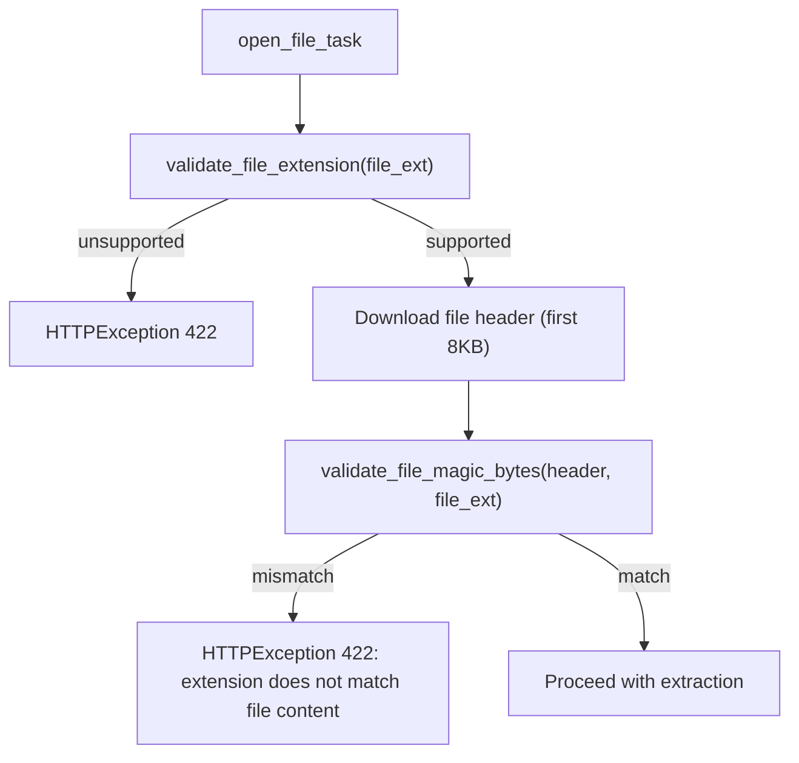
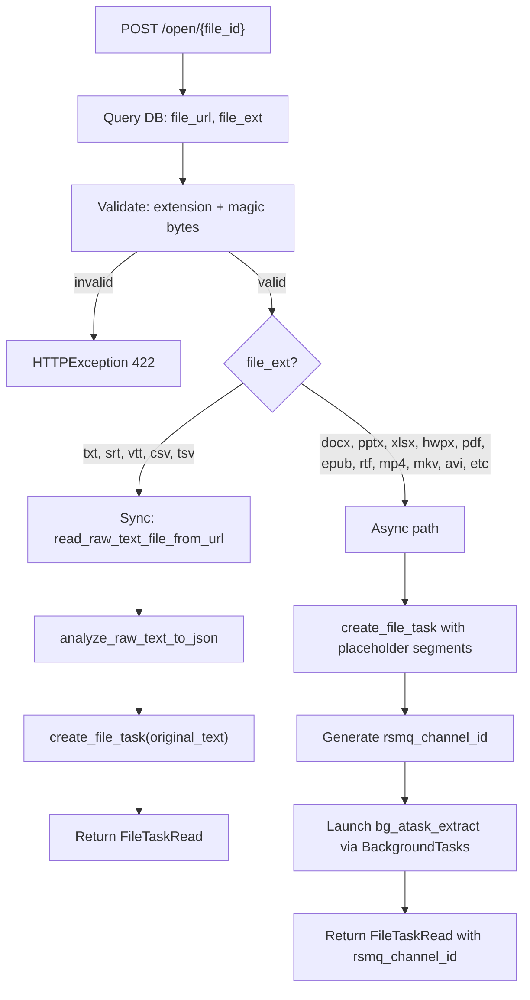
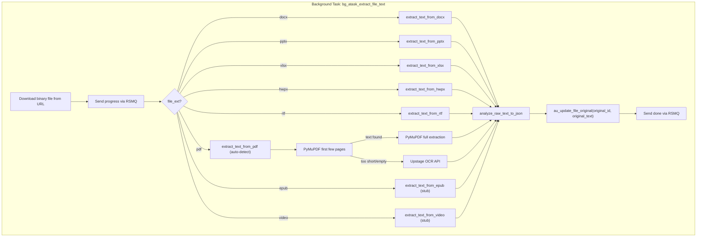

---

# File Text Extraction Plan (V2 -- with Streaming)

## File Type Validation

Validation runs at `open_file_task` time using both extension check and magic bytes verification:



### New file: `app/utils/utils_file_validate.py`

- `**validate_file_extension(file_ext: str) -> FileCategory**` -- Checks if extension is in the supported list. Returns a category enum (`TEXT`, `DOCX`, `PPTX`, `XLSX`, `HWPX`, `PDF`, `EPUB`, `RTF`, `VIDEO`). Raises `ValueError` if unsupported.
- `**validate_file_magic_bytes(file_bytes: bytes, file_ext: str) -> bool**` -- Reads the first few bytes and verifies the actual format matches the claimed extension. Returns `True` if valid, `False` if mismatch.

Magic bytes signatures:

**ZIP-based formats** -- all share `PK` header (`50 4B 03 04`), distinguished by internal ZIP entries:

- **DOCX**: root entries must include `[Content_Types].xml`, `_rels/`, `word/`
- **PPTX**: root entries must include `[Content_Types].xml`, `_rels/`, `ppt/`
- **XLSX**: root entries must include `[Content_Types].xml`, `_rels/`, `xl/`
- **HWPX**: root entries must include `Contents/`, `META-INF/manifest.xml` (no `[Content_Types].xml`). Also has `mimetype` (sometimes), `version.xml`
- **EPUB**: first file entry must be `mimetype` (uncompressed), content must equal `application/epub+zip`

**Non-ZIP formats:**

- **PDF**: starts with `%PDF-` (`25 50 44 46 2D`), followed by version string (e.g. `%PDF-1.7`)
- **MP4/MOV**: `bytes[4:8] == "ftyp"` (`66 74 79 70`). Structure: `00 00 00 ?? 66 74 79 70` + brand code
- **MKV/WebM**: EBML header `1A 45 DF A3` (identifies Matroska/WebM)
- **AVI**: `bytes[0:4] == "RIFF"` (`52 49 46 46`) AND `bytes[8:12] == "AVI "` (`41 56 49 20`)
- **FLV**: starts with `FLV` (`46 4C 56`), usually followed by version byte `01`
- **WMV**: full 16-byte ASF header GUID: `30 26 B2 75 8E 66 CF 11 A6 D9 00 AA 00 62 CE 6C`
- **RTF** (async): starts with `{\rtf` (`7B 5C 72 74 66`); RTF files always begin with this signature
- **Text files** (txt, srt, vtt, csv, tsv): no reliable magic bytes. Skip magic bytes check

Integration point:

- [app/api/v1/endpoints/file_task.py](app/api/v1/endpoints/file_task.py): call validation in `open_file_task` before extraction begins

---

## Two-Path Architecture





This mirrors the existing pattern:

- [file_translation.py](app/api/v1/endpoints/file_translation.py): endpoint creates record, launches background task, returns `rsmq_channel_id`
- [file_translation_task.py](app/api/v1/endpoints/file_translation_task.py): background task does the heavy work, streams progress via RSMQ, updates DB

Key DB fact: `au_update_file_original(p_original_id, p_original_text)` **already exists** in [schema-public.file.original.sql](scripts/schema-functions/schema-public.file.original.sql) (line 77), so the background task can update the extracted text without any SQL changes.

---

## Changes by File

### 1. New file: `app/utils/utils_file_extract.py`

Extraction functions (all return `str` -- plain text with `\n\n` at logical boundaries).

Each extractor inserts `\n\n` (double newline) between logical segments specific to the format (paragraphs, slides, rows, etc.). The returned text is then passed through the existing `analyze_raw_text_to_json()` + `add_sentence_markers()` pipeline, which handles final sentence-level segmentation.

**ZIP-based Office formats (all fully implemented):**

- `**extract_text_from_docx(file_bytes: bytes) -> str` -- Uses `python-docx` (already in `requirements.txt`). Iterates paragraphs, `\n\n` between paragraphs.
- `**extract_text_from_pptx(file_bytes: bytes) -> str` -- Uses `python-pptx`. Iterates slides and shapes, extracts text from text frames. `\n\n` between slides.
- `**extract_text_from_xlsx(file_bytes: bytes) -> str` -- Uses `openpyxl` (already in `requirements.txt`). Iterates sheets and rows, extracts cell values. `\n\n` between rows.
- `**extract_text_from_hwpx(file_bytes: bytes) -> str` -- Parses ZIP archive, reads `Contents/section0.xml`, `section1.xml`, etc. in order, extracts text from `<hp:t>` tags. `\n\n` between paragraphs. HWPX structure: `Contents/` (section XMLs + header.xml), `META-INF/manifest.xml`, `Preview/`, `version.xml`.

**Other formats:**

- `**extract_text_from_pdf(file_bytes: bytes) -> str` -- Auto-detect: try PyMuPDF on first ~3 pages. If text is sufficient, extract full doc with PyMuPDF. If too short/empty, fallback to Upstage OCR. `\n\n` between pages.
- `**_extract_text_from_pdf_pymupdf(file_bytes: bytes) -> str` -- PyMuPDF text extraction.
- `**_extract_text_from_pdf_ocr(file_bytes: bytes) -> str` -- Upstage OCR API call. Endpoint: `https://api.upstage.ai/v1/document-digitization`, model: `ocr`. Uses `httpx` to POST multipart form data.
- `**extract_text_from_epub(file_bytes: bytes) -> str` -- Stub only (`raise NotImplementedError`).
- `**extract_text_from_rtf(file_bytes: bytes) -> str` -- Extract plain text from RTF (e.g. strip control words via library or regex). `\n\n` between paragraphs. Async path.
- `**extract_text_from_video(file_url: str) -> str` -- Stub only (`raise NotImplementedError`).

### 2. New file: `app/api/v1/endpoints/file_task_extract.py`

Background task module (mirrors [file_translation_task.py](app/api/v1/endpoints/file_translation_task.py)):

```python
async def bg_atask_extract_file_text(
    rsmq_channel_id: str,
    original_id: uuid.UUID,
    file_url: str,
    file_ext: str,
) -> None:
```

Steps:

1. Init RSMQ, send `{"type": "progress", "message": "Downloading file..."}`
2. Download binary file via `read_binary_file_from_url`
3. Send `{"type": "progress", "message": "Extracting text..."}`
4. Call appropriate extractor based on `file_ext`
5. Convert to segments via `analyze_raw_text_to_json`
6. Update DB via `au_update_file_original(original_id, original_text)`
7. Send `{"type": "done"}`
8. On error: send `{"type": "error", "message": "..."}`

### 3. Modify: [app/utils/utils_http.py](app/utils/utils_http.py)

Add `read_binary_file_from_url(file_url: str) -> bytes`:

- Same pattern as existing `read_raw_text_file_from_url` but returns `response.content` (bytes)
- Higher timeout for large files (e.g., 120s)

### 4. Modify: [app/core/config.py](app/core/config.py)

Add to `Settings`:

```python
UPSTAGE_API_KEY: str | None = None
```

### 5. Modify: [app/models/file_task.py](app/models/file_task.py)

Add optional field to existing `FileTaskRead`:

```python
class FileTaskRead(FileTaskBase):
    rsmq_channel_id: str | None = None  # present when async extraction is in progress
    created_at: datetime
    updated_at: datetime
```

### 6. Modify: [app/api/v1/endpoints/file_task.py](app/api/v1/endpoints/file_task.py)

Update `open_file_task`:

- Keep `response_model=FileTaskRead` (now includes optional `rsmq_channel_id`)
- Update SQL query to also SELECT `file_ext` (line 78)
- **Validate file type**: call `validate_file_extension` + download header and call `validate_file_magic_bytes` before extraction
- Add file type classification logic
- **Sync path** (txt, srt, vtt, csv, tsv): extract inline, create task, return without `rsmq_channel_id`
- **Async path** (docx, pptx, xlsx, hwpx, pdf, epub, rtf, video):
  - Create file task with placeholder `{"segments": []}`
  - Generate `rsmq_channel_id` via `uuid7()`
  - Add `bg_atask_extract_file_text` to `BackgroundTasks`
  - Return `FileTaskRead` with `rsmq_channel_id` set
- Add `BackgroundTasks` parameter to endpoint signature
- Import new modules

### 7. Modify: `requirements.txt`

Add `pymupdf` (PyMuPDF, imported as `fitz`) and `python-pptx`. Note: `python-docx` and `openpyxl` are already present.

---

## File Type Classification

| Category      | Extensions                                              | Path                                   |
| ------------- | ------------------------------------------------------- | -------------------------------------- |
| Text (sync)   | `.txt`, `.srt`, `.vtt`, `.csv`, `.tsv`                  | Existing `read_raw_text_file_from_url` |
| DOCX (async)  | `.docx`                                                 | `extract_text_from_docx`               |
| PPTX (async)  | `.pptx`                                                 | `extract_text_from_pptx`               |
| XLSX (async)  | `.xlsx`                                                 | `extract_text_from_xlsx`               |
| HWPX (async)  | `.hwpx`                                                 | `extract_text_from_hwpx`               |
| PDF (async)   | `.pdf`                                                  | `extract_text_from_pdf` (auto-detect)  |
| EPUB (async)  | `.epub`                                                 | `extract_text_from_epub` (stub)        |
| RTF (async)   | `.rtf`                                                  | `extract_text_from_rtf`                |
| Video (async) | `.mp4`, `.mkv`, `.avi`, `.mov`, `.webm`, `.flv`, `.wmv` | `extract_text_from_video` (stub)       |
| Unsupported   | anything else                                           | `HTTPException(422)`                   |

---

## SSE Event Flow (Client Contract)

The client subscribes to `GET /api/v1/mq/channels/{channel_id}/events` via `EventSource`.

### Event Types

All terminal events (`done`, `error`) are sent under SSE event name `system`.
Progress events are sent under SSE event name `progress`.

**Important:** The SSE event name `error` is reserved by `EventSource` for connection-level errors. Server never uses it as a custom event name.

| SSE event name | `payload.type` | `payload.data`                                        | Client action                                    |
| -------------- | -------------- | ----------------------------------------------------- | ------------------------------------------------ |
| `system`       | `"connected"`  | `{"type":"connected","consumer":"..."}`               | Connection ready                                 |
| `progress`     | `"data"`       | `{"type":"progress","message":"Downloading file..."}` | Show progress indicator                          |
| `system`       | `"done"`       | `{"type":"done"}`                                     | Handle success, call `es.close()`                |
| `system`       | `"error"`      | `{"type":"error","message":"PDF file too large..."}`  | Display error message to user, call `es.close()` |

### Success Flow

```
Server                              Client (EventSource)
  |                                      |
  |  event: system                       |
  |  {"type":"connected"}                |
  |  --------------------------------->  |  (connection established)
  |                                      |
  |  event: progress                     |
  |  {"type":"data",                     |
  |   "data":{"type":"progress",         |
  |     "message":"Downloading..."}}     |
  |  --------------------------------->  |  (show progress)
  |                                      |
  |  event: progress                     |
  |  {"type":"data",                     |
  |   "data":{"type":"progress",         |
  |     "message":"Extracting text..."}} |
  |  --------------------------------->  |  (show progress)
  |                                      |
  |  event: progress                     |
  |  {"type":"data",                     |
  |   "data":{"type":"progress",         |
  |     "message":"Processing..."}}      |
  |  --------------------------------->  |  (show progress)
  |                                      |
  |  event: system                       |
  |  {"type":"done",                     |
  |   "data":{"type":"done"}}            |
  |  --------------------------------->  |  (success, call es.close())
  |                                      |
  |  [server closes stream]              |
```

### Error Flow

```
Server                              Client (EventSource)
  |                                      |
  |  event: system                       |
  |  {"type":"connected"}                |
  |  --------------------------------->  |  (connection established)
  |                                      |
  |  event: progress                     |
  |  {"type":"data",                     |
  |   "data":{"type":"progress",         |
  |     "message":"Downloading..."}}     |
  |  --------------------------------->  |  (show progress)
  |                                      |
  |  event: system                       |
  |  {"type":"error",                    |
  |   "data":{"type":"error",            |
  |     "message":"PDF file too large    |
  |      for OCR processing (25.3 MB).   |
  |      Please use a smaller file."}}   |
  |  --------------------------------->  |  (show error, call es.close())
  |                                      |
  |  [server closes stream]              |
```

### Client Rules

1. Listen on `addEventListener("system", ...)` and `addEventListener("progress", ...)`
2. **Never** listen on `"error"` event name -- it is reserved by `EventSource` for connection errors
3. Client **must** call `es.close()` on both `done` and `error`
4. Server closes the stream after sending the terminal event; client receives it then calls `es.close()`
5. Check `payload.type` to distinguish `"done"` vs `"error"` in system events
