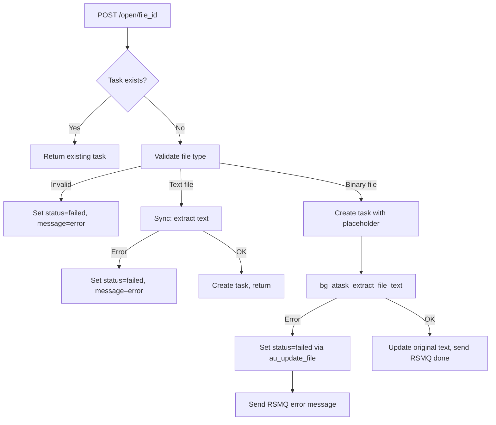

# File Node Status/Message Integration

## Current State

- `au_file_nodes` table now has `status VARCHAR(32) DEFAULT 'ready'` and `message TEXT NULL` columns in [schema-public.au-file-x.sql](scripts/schema-public.au-file-x.sql)
- These columns are **not yet referenced** anywhere in SQL functions, models, or endpoints
- The `au_file_translation` table already has a working `status`/`message` pattern that we can follow

## Changes Required

### A. SQL Functions

**1. Extend `au_update_file()` in [schema-public.file.file.sql](scripts/schema-functions/schema-public.file.file.sql)**

- Add `p_status VARCHAR(32) DEFAULT NULL` and `p_message TEXT DEFAULT NULL` parameters
- Add `status = COALESCE(p_status, status)` and `message = COALESCE(p_message, message)` to the UPDATE SET clause
- Follows the same COALESCE pattern already used for `file_name` and `description`

**2. Update `au_get_files()` in [schema-public.file.file.sql](scripts/schema-functions/schema-public.file.file.sql)**

- Add `n.status` and `n.message` to the RETURNS TABLE and all four SELECT branches (all-files, shared-files, trash-files, nodes)

**3. Update `au_get_file_task_with_details()` in [schema-public.file.task.sql](scripts/schema-functions/schema-public.file.task.sql)**

- Add `n.status` and `n.message` (aliased as `file_status` and `file_message` to avoid collision with the function's own return column naming) to the RETURNS TABLE and the SELECT ... JOIN

### B. Python Models

**4. [app/models/file_node.py](app/models/file_node.py)**

- Add `status: str = "ready"` and `message: str | None = None` to `FileNodeBase` (inherited by `FileNode` table model and `FileNodeRead`)

**5. [app/models/file_task.py](app/models/file_task.py)**

- Add `status: str = "ready"` and `message: str | None = None` to `FileTaskReadWithDetails`

### C. API Endpoints

**6. [app/api/v1/endpoints/file_node.py](app/api/v1/endpoints/file_node.py)**

- `get_file_nodes()`: Add `status` and `message` to the SELECT query and response dict

**7. [app/api/v1/endpoints/file_task.py](app/api/v1/endpoints/file_task.py)**

- `open_file_task()`: On sync-path exceptions (validation, read errors), update `au_file_nodes.status='failed'` with the error message before raising HTTPException
- `open_file_task()`: Pass `file_id` to `bg_atask_extract_file_text()` so the background task can update the node status on failure
- `get_file_task_with_details()`: Add `status` and `message` to SELECT and response dict

**8. [app/api/v1/endpoints/file_task_extract.py](app/api/v1/endpoints/file_task_extract.py)**

- `bg_atask_extract_file_text()`: Accept `file_id` parameter
- In all three error handlers (`NotImplementedError`, `ValueError`, generic `Exception`): call a new helper `_update_file_node_status(file_id, 'failed', error_message)` to persist the error to `au_file_nodes`
- On success path: leave as default since it was created with `'ready'`
- Add `_update_file_node_status()` helper that calls the existing `au_update_file()` SQL function (with the new `p_status`/`p_message` params)

## Data Flow

