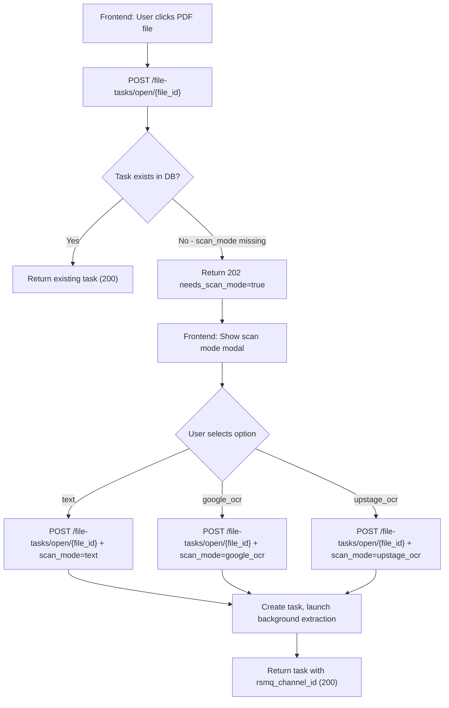

# PDF Scan Mode Selection Plan

## Flow Diagram



## Backend Changes

### 1. `[app/models/file_task.py](app/models/file_task.py)`

- Add `ScanMode` enum: `text | google_ocr | upstage_ocr`
- Add `FileTaskScanRequired` response model: `{ needs_scan_mode: true, file_id }`

### 2. `[app/api/v1/endpoints/file_task.py](app/api/v1/endpoints/file_task.py)`

- Add optional `scan_mode: ScanMode | None = None` to the `open_file_task` request body (new `OpenFileTaskRequest` schema)
- Modify Step 4b (ASYNC PATH, PDF only):
  - If `file_ext == ".pdf"` and `scan_mode is None` → return `202` with `FileTaskScanRequired`
  - If `scan_mode` is provided → proceed normally, pass `scan_mode` to background task
- All other formats (DOCX, PPTX, etc.) remain unchanged

```python
# New logic inserted before Step 4b for PDF
if category == FileCategory.PDF and scan_mode is None:
    return JSONResponse(
        status_code=202,
        content={"needs_scan_mode": True, "file_id": str(file_id)}
    )
```

### 3. `[app/api/v1/endpoints/file_task_extract.py](app/api/v1/endpoints/file_task_extract.py)`

- Add `scan_mode: str = "text"` to `bg_atask_extract_file_text` signature
- Pass `scan_mode` into the PDF extractor call

### 4. `[app/utils/utils_file_extract.py](app/utils/utils_file_extract.py)`

- Add `_extract_text_from_pdf_google_ocr(file_bytes)` using Google Cloud Vision API
- Refactor `extract_text_from_pdf` into a dispatcher:

```python
def extract_text_from_pdf(file_bytes: bytes, scan_mode: str = "text") -> str:
    if scan_mode == "google_ocr":
        return _extract_text_from_pdf_google_ocr(file_bytes)
    elif scan_mode == "upstage_ocr":
        return _extract_text_from_pdf_ocr(file_bytes)  # existing Upstage
    else:  # "text"
        return _extract_text_from_pdf_pymupdf(file_bytes)  # existing PyMuPDF
```

- Remove the auto-detection fallback logic (the `avg_chars` heuristic) - mode is now explicit

### 5. `[app/core/config.py](app/core/config.py)`

- Add `GOOGLE_CLOUD_VISION_API_KEY: str = ""` setting (Upstage key already exists)

## Scan Mode Behavior Summary

- `text` — PyMuPDF direct text layer extraction (fast, no OCR)
- `google_ocr` — Google Cloud Vision API, returns text split into blocks per image region
- `upstage_ocr` — Upstage Document Digitization API (`/v1/document-digitization`), left-to-right alignment (already implemented as `_extract_text_from_pdf_ocr`)

## Frontend (not in this repo)

- On `202` response with `needs_scan_mode: true`, show modal with 3 options
- On selection, re-call `POST /file-tasks/open/{file_id}` with `{ scan_mode: "text" | "google_ocr" | "upstage_ocr" }` in request body
- On `200`, proceed as normal (start listening to `rsmq_channel_id`)
