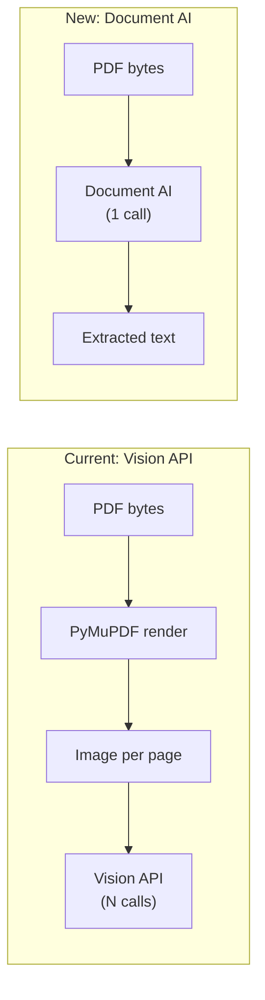

# Migrate Google OCR from Vision API to Document AI

## Current state

`_extract_text_from_pdf_google_ocr` in `[app/utils/utils_file_extract.py](app/utils/utils_file_extract.py)` (lines 216-262) renders each PDF page to a PNG via PyMuPDF, base64-encodes it, and sends it to `vision.googleapis.com/v1/images:annotate`. This is slow (one HTTP call per page) and uses a simple API key (`GOOGLE_CLOUD_VISION_API_KEY`).

## Target state

Use the **Document AI online processing API** (`{location}-documentai.googleapis.com`), which accepts the raw PDF bytes in a single request and returns extracted text. Auth via `GOOGLE_APPLICATION_CREDENTIALS` (service account JSON key file).



## Changes

### 1. Add dependency

Add `google-cloud-documentai` to `[requirements.txt](requirements.txt)`.

### 2. Update config -- `[app/core/config.py](app/core/config.py)`

- Remove `GOOGLE_CLOUD_VISION_API_KEY: str | None = None` (line 149)
- Add three new settings:

```python
GOOGLE_CLOUD_PROJECT_ID: str | None = None
GOOGLE_CLOUD_LOCATION: str = "us"
GOOGLE_DOCUMENT_AI_PROCESSOR_ID: str | None = None
```

Auth is handled by the `GOOGLE_APPLICATION_CREDENTIALS` env var (set externally, not in Settings).

### 3. Rewrite `_extract_text_from_pdf_google_ocr` -- `[app/utils/utils_file_extract.py](app/utils/utils_file_extract.py)`

- Replace the entire function (lines 216-262) with a Document AI implementation that:
  - Reads `GOOGLE_CLOUD_PROJECT_ID`, `GOOGLE_CLOUD_LOCATION`, `GOOGLE_DOCUMENT_AI_PROCESSOR_ID` from settings
  - Creates a `DocumentProcessorServiceClient` with the correct regional endpoint
  - Sends PDF bytes as a `RawDocument` with `mime_type="application/pdf"`
  - Returns `result.document.text`
- Remove `base64` import (line 10) -- no longer needed (only the Vision path used it)
- Update the docstring/comment block (lines 127-131) to reflect Document AI instead of Vision API

### 4. Update env template -- `[deployment/.env.local](deployment/.env.local)`

- Remove any `GOOGLE_CLOUD_VISION_API_KEY` reference
- Add:

```
GOOGLE_CLOUD_PROJECT_ID=""
GOOGLE_CLOUD_LOCATION="us"
GOOGLE_DOCUMENT_AI_PROCESSOR_ID=""
```

`GOOGLE_APPLICATION_CREDENTIALS` should be set as a system env var pointing to the service account JSON file.

### 5. Update docstring in `extract_text_from_pdf`

Line 141 currently says `"google_ocr" (Google Cloud Vision)` -- change to `"google_ocr" (Google Document AI)`.
